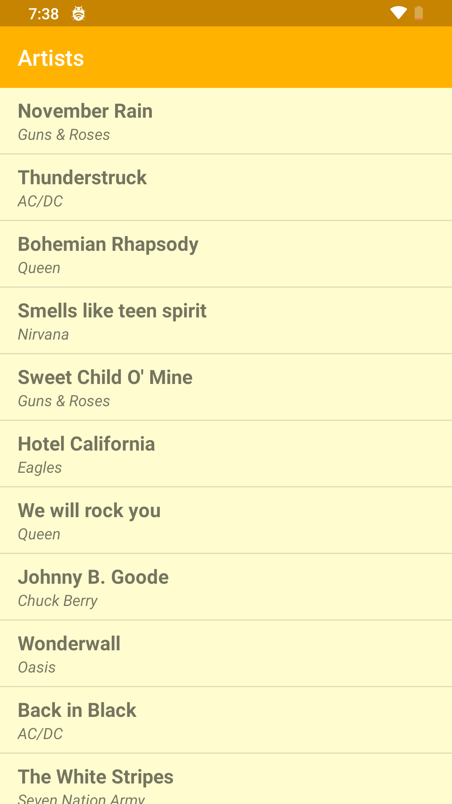

# BandPeep

* An Android application that shows a vertical list of Songs w/ their artists.
* Tapping on an item toasts the name of the clicked item.

# Technical Info

* Written purely in Java.
* Using the best practices such as interfacing to implement click listener on the RecyclerView .

# Screenshots

  

# Dependencies

* <b>Support:</b> AppCompat, Design, ConstraintLayout

# Download

<a href="https://github.com/gitryder/BandPeep/raw/master/apk/BandPeep.apk">Click here to download!</a>
